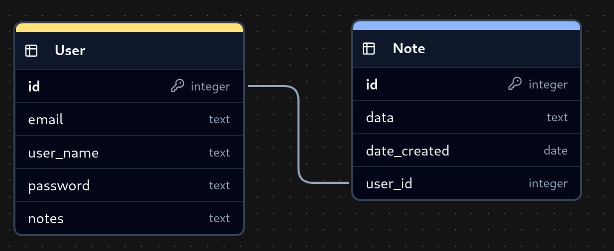

# An Overview 

🌟 Welcome to my journey of building and deploying a website! 🌟

This repository shows my daily progress, with each day dedicated to a separate branch. You can check out any branch to see the code for that specific day. Each new day builds upon the previous day's work, adding more features and improvements. You can see the state of each day by checking out the corresponding branch.

```bash
git checkout Day1
```

# Table of Contents

<details>
  <summary>Click to expand!</summary>

- [Day 1: Learning Flask](#day-1-learning-flask)
    - [Building a Simple Flask App](#building-a-simple-flask-app)
    - [Features and Demo](#features-and-demo)

</details>
<br>

# Day 1: Learning Flask

The first step in building a website is selecting a web framework that aligns with your goals. I chose **Flask**, a lightweight and beginner-friendly Python framework, making it ideal for small to medium-sized projects. While more complex frameworks like Django are better suited for large-scale applications, Flask offers simplicity and flexibility, making it a great choice for beginners.

To begin, I followed this [tutorial](https://youtu.be/dam0GPOAvVI?si=xYlYCGXooBzz3B-V) to learn the basics of creating a website with Flask.

A typical Flask project structure looks like this:

```plaintext
flask_project/
    ├── website/                        # Contain all the application code
    │   ├── __init__.py                 # Initialize the website and load all the components
    │   ├── routes.py                   # Define all the routes of the application (Render UI and handle logical with correspodings URLs)
    │   ├── models.py                   # Define objects to work with the database   
    │   ├── templates/                  # Contain all the HTML templates
    │   │   └── base.html               # Base template for all the other templates to inherit from
    │   │   
    │   └── static/                     # Contain all the static files like CSS, JS, images
    │       │── css/
    │       └── js/
    │ 
    ├── venv/                           # Virtual environment for project dependencies
    ├── requirements.txt                # List of all the dependencies
    ├── main.py                         # Start the application
    └── config.py                       # Configuration file for the application  (Optional) 
```

## Building a Simple Flask App

The goal is to create a web app where users can register, log in, log out, and manage notes stored in a database.

1. Setting Up a Virtual Environment
```bash
python3 -m venv venv
source venv/bin/activate
```

2. Installing Dependencies

```bash
pip install -r requirements.txt
```
If any issues arise, try to install manually dependencies:

```bash
pip install flask flask-sqlalchemy flask_login
```

Now you can start coding your Flask app. In case of mine:

1. Start from `__init__.py`, I set up the Flask app, configures `SECRET_KEY`, database settings, register routes (URLs) and initializes extensions like LoginManager.

2. The `routes.py` and `auths.py` defined all possible URLs that user can visit, then render UI, handle logical for these URLs (`routes.py` handles general 
page routes like /home, while `auth.py` manages authentication routes (/login, /register, /logout)). 

    Each URL renders the corresponding HTML file and processes user input. Flask uses **Jinja2** templating to render HTML files, allowing us to embed Python code within html file. Jinja2 supports embedding variables (e.g., `{{ variable }}`), control structures like loops and conditionals (e.g.,``), and template inheritance (e.g.,``).

    The HTML files are located in the `templates` folder and inherit from `base.html`. The `base.html` file forms the basic structure of the website, which looks something like this:


    

    *Include the navigation bar (A collapsible navbar with item: home, login, register, logout), flask message area and a content block.*

    All other HTML files will inherit from `base.html`, keep the navigation bar and message area, but override the content block with their own content. The `base.html` also contains the currently logged-in `user` object, which is centralized so that every HTML file can access it. This object will be provided by the register or login HTML file when the form is submitted. 


3. `models.py` is used to define models (from a Python perspective) or table schemas (from a database perspective). In this project, we use two tables: `User` and `Note`. These tables are connected with a foreign key. To convert between python objects and database tables, we use SQLAlchemy. By default, Flask creates an `instance` folder at the root of your application. This folder stores instance-specific data like SQLite databases and config files, keeping configuration and data that should not be in version control separate from your main application code. Here is the database schema:

    

    *The `User` table stores user information like username, email, and password. The `Note` table stores note information like title, content, and the user who created it. The `user_id` column in the `Note` table is a foreign key that links each note to the user who created it.*

4. The `static` folder is empty because we do not need custom CSS or JS frameworks. We already include the Bootstrap framework in `base.html`, which handles CSS and animations for us.

5. `main.py`: Run this file will trigger `__init__.py` to start our website. Access the website at ` http://127.0.0.1:5000`


**The workflow of the website is as follows:**

1. Users interact with HTML templates in the templates folder. When they submit a form, the data is sent to the corresponding route in `routes.py` or `auth.py`.

2. These route receive user input, process logic, and interact with `models.py` to update or retrieve data.

3. The processed data is returned and rendered in the appropriate HTML template.

## Features and Demo

1. **Register**: Users can create an account by providing a username, email, and password. The password is hashed before being stored in the database.


2. **Login**: Users can log in using their username and password. If the credentials are correct, they are redirected to the home page. Otherwise, an error message is displayed.


3. **Home Page**: After logging in, users can view all their notes. They can also add new notes, delete notes. This home page URL can only be accessed by authenticated users, otherwise, they are redirected to the login page.


4. **Logout**: Users can log out of their account, which redirects them to the login page.


# Day 2: Deploying with Docker

## Setup Database path

Today, I learned how to deploy a Flask application using Docker. Docker is a platform that allows you to package your application and its dependencies into a container, ensuring that it runs consistently across different environments. This makes it easy to deploy your application to any server without worrying about compatibility issues.

I watch some of these tutorials to understand the basics concepts and commands of Docker: [Docker theory](https://youtu.be/pg19Z8LL06w?si=Z5aPc8_v5rSXMMyG), [Docker compose](https://youtu.be/pg19Z8LL06w?si=Z5aPc8_v5rSXMMyG), [Dokcer commands](https://www.youtube.com/watch?v=B5wf8p1oezA)

First, I need to change database path in the source code to make it work with Docker. 

```python
DB_PATH_IN_DOCKER= '/app/instance/database.db'  # Path for Docker volume (See this in the docker-compose.yml file, volumes section)
DB_NAME = DB_PATH_IN_DOCKER if os.getenv('DOCKER_ENV') else 'database.db' 
```
So PATH of the database will dynamically change based on the environment variable `DOCKER_ENV`:
 - If running in Docker: /app/instance/database.db
 - If running locally: ./instance/database.db (In localy, just give the databse name, Flask will create the instance folder and handle the path automatically)

For a simple database like SQLite, which is lightweight and file-based (meaning it stores data in a single file, no server required), we can set it up inside the website container itself. For a more complex database like MySQL that run as a separate server, we need set up a separate container for the database and connect it to the website container. 

## Dockerfile

Next, I created a `Dockerfile` to build the Docker image. The Dockerfile contains instructions to build the image, such as installing dependencies, copying files, and setting environment variables. See the Dockerfile [here](/Dockerfile)

You can test if the Dockerfile works by building the image and running the container:

```bash
docker build -t flask-website .
docker run -p 5000:5000 flask-website
```

## Docker Compose

Then, I created a `docker-compose.yml` file to define the services needed to run the application. The `docker-compose.yml` file specifies the image to use, environment variables, ports binding, and volumes to mount. In this case, we only have one service, the Flask website (the SQLitedatabase will be set up inside the website container) and the database is stored in a volume to persist data between container restarts. See the docker-compose.yml file [here](/docker-compose.yml).

To build and run the application using Docker Compose:

```bash
docker compose up --build
```

After that, the website should be accessible at `http://127.0.0.1:5000`.


